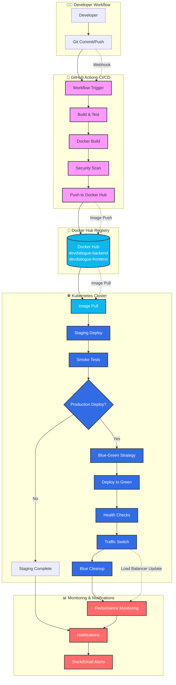

# 🚀 DevDialogue CI/CD Architecture

## Приложение А, Рис. 5 - Схема взаимодействия GitHub Actions, Docker Hub и Kubernetes

### 📊 Детальная архитектурная диаграмма

### 🔄 Упрощенная схема потока данных

## 📋 Описание этапов взаимодействия

### 1. **GitHub Actions** (Оркестратор CI/CD)
- **Триггер**: Webhook от Git push активирует workflow
- **Сборка**: Установка зависимостей, линтинг, тестирование
- **Docker Build**: Создание образов backend и frontend
- **Security Scan**: Проверка уязвимостей в коде и зависимостях
- **Push**: Отправка образов в Docker Hub с тегами

### 2. **Docker Hub** (Централизованный реестр образов)
- **Хранение**: Версионированные образы приложения
- **Теги**: SHA коммитов для точной идентификации версий
- **Доступ**: Безопасное получение образов Kubernetes кластером
- **Метаданные**: Информация о сборке и зависимостях

### 3. **Kubernetes** (Оркестратор контейнеров)
- **Image Pull**: Получение новых образов из Docker Hub
- **Staging Deploy**: Развертывание в тестовой среде
- **Smoke Tests**: Базовые проверки функциональности
- **Blue-Green Strategy**: Безопасное обновление production
- **Health Checks**: Мониторинг состояния приложения
- **Traffic Management**: Управление нагрузкой между версиями

### 4. **Мониторинг и уведомления**
- **Performance Monitoring**: Отслеживание метрик производительности
- **Alerting**: Автоматические уведомления о проблемах
- **Logging**: Централизованное логирование событий
- **Rollback**: Возможность быстрого отката при проблемах

## 🎯 Преимущества автоматизации

### ⚡ Скорость доставки
- Сокращение времени от коммита до production с **часов до минут**
- Автоматизация рутинных операций
- Параллельное выполнение этапов pipeline

### 🛡️ Стабильность и надежность
- Автоматизированное тестирование на каждом этапе
- Blue-Green deployment исключает простои
- Возможность быстрого отката к предыдущей версии

### 🔄 Непрерывная интеграция
- Раннее обнаружение конфликтов и ошибок
- Консистентная среда развертывания
- Автоматическая проверка качества кода

### 📊 Прозрачность процесса
- Полная трассируемость изменений
- Детальные логи каждого этапа
- Метрики производительности и качества
