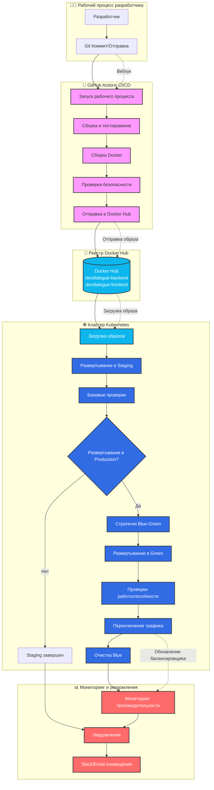

# CI/CD Pipeline Architecture

## Рис. 5 - Схема взаимодействия GitHub Actions, Docker Hub и Kubernetes

## Описание взаимодействия

### 1. **GitHub Actions** (Оркестратор)
- Получает webhook от Git push
- Выполняет сборку и тестирование
- Создает Docker образы
- Отправляет образы в Docker Hub

### 2. **Docker Hub** (Реестр образов)
- Хранит версионированные образы
- Обеспечивает доступ для Kubernetes
- Поддерживает теги и метаданные

### 3. **Kubernetes** (Среда выполнения)
- Получает образы из Docker Hub
- Управляет развертыванием
- Реализует Blue-Green стратегию
- Обеспечивает мониторинг и масштабирование

### 4. **Преимущества автоматизации**
- ⚡ Сокращение времени доставки с часов до минут
- 🛡️ Повышение стабильности через автоматизированное тестирование
- 🔄 Безопасные обновления без простоев
- 📊 Непрерывный мониторинг и быстрое реагирование
